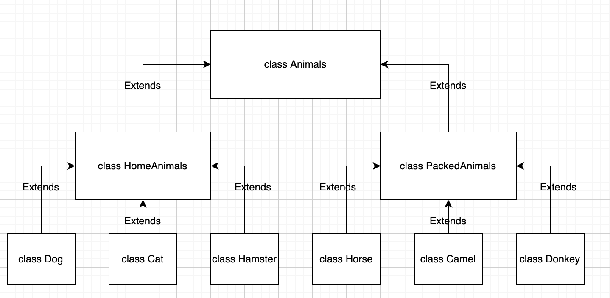

# Итогова аттестация

## Задание

### Задание 1

Используя команду cat в терминале операционной системы Linux, создать
два файла Домашние животные (заполнив файл собаками, кошками,
хомяками) и Вьючные животными заполнив файл Лошадьми, верблюдами и
ослы), а затем объединить их. Просмотреть содержимое созданного файла.
Переименовать файл, дав ему новое имя (Друзья человека).

**Решение**

```
user@docker-server1:~/GB$ cat > home_amimals
dogs, cats, hamsters

user@docker-server1:~/GB$ cat > pack_animals
Horses, camels and donkeys

user@docker-server1:~/GB$ ls
home_amimals  pack_animals

user@docker-server1:~/GB$ cat home_amimals pack_animals > Mans_friends
user@docker-server1:~/GB$ cat Mans_friends 
dogs, cats, hamsters
Horses, camels and donkeys
```

### Задание 2

Создать директорию, переместить файл туда.

**Решение**

```
user@docker-server1:~$ mkdir dir_file
user@docker-server1:~$ ls
dir_file  file_1

user@docker-server1:~$ mv file_1 dir_file/
user@docker-server1:~$ ls
dir_file

user@docker-server1:~$ ls dir_file/
file_1

```

### Задание 3

Подключить дополнительный репозиторий MySQL. Установить любой пакет
из этого репозитория

**Решение**

```
user@docker-server1:~$ sudo apt-get update
user@docker-server1:~$ sudo apt-get install mysql-server

done!
update-alternatives: используется /var/lib/mecab/dic/ipadic-utf8 для предоставления /var/lib/mecab/dic/debian (mecab-dictionary) в автоматическом режиме
Настраивается пакет libhtml-parser-perl:amd64 (3.76-1build2) …
Настраивается пакет libhttp-message-perl (6.36-1) …
Настраивается пакет mysql-server-8.0 (8.0.32-0ubuntu0.22.04.2) …
update-alternatives: используется /etc/mysql/mysql.cnf для предоставления /etc/mysql/my.cnf (my.cnf) в автоматическом режиме
Renaming removed key_buffer and myisam-recover options (if present)
mysqld will log errors to /var/log/mysql/error.log
mysqld is running as pid 12277
Created symlink /etc/systemd/system/multi-user.target.wants/mysql.service → /lib/systemd/system/mysql.service.
Настраивается пакет libcgi-pm-perl (4.54-1) …
Настраивается пакет libhtml-template-perl (2.97-1.1) …
Настраивается пакет mysql-server (8.0.32-0ubuntu0.22.04.2) …
Настраивается пакет libcgi-fast-perl (1:2.15-1) …
Обрабатываются триггеры для man-db (2.10.2-1) …
Обрабатываются триггеры для libc-bin (2.35-0ubuntu3.1) …
Scanning processes...                                                                                                                                           
Scanning linux images...                                                                                                                                        

Running kernel seems to be up-to-date.

No services need to be restarted.

No containers need to be restarted.

No user sessions are running outdated binaries.

No VM guests are running outdated hypervisor (qemu) binaries on this host.
```

### Задание 4

Установить и удалить deb-пакет с помощью dpkg.

**Решение**

````
sudo wget https://download.docker.com/linux/ubuntu/dists/jammy/pool/stable/amd64/docker-ce-cli_20.10.13~3-0~ubuntu-jammy_amd64.deb
sudo dpkg -i docker-ce-cli_20.10.133-0ubuntu-jammy_amd64.deb
sudo dpkg -r docker-ce-cli
````

**Задание 5**

Выложить историю команд в терминале ubuntu.

**Решение**

[Задача 1](#Задание-1)

[Задача 2](#Задание-2)

[Задача 3](#Задание-3)

[Задача 4](#Задание-4)

**Задание 6**

Нарисовать диаграмму, в которой есть класс родительский класс, домашние животные и вьючные животные, в составы которых в
случае домашних животных войдут классы: собаки, кошки, хомяки, а в класс вьючные животные войдут: Лошади, верблюды и
ослы).

**Решение**



**Задание 7**

В подключенном MySQL репозитории создать базу данных “Друзья человека”

**Решение**

```sql
CREATE
DATABASE human_friends;
```

**Задание 8**

Создать таблицы с иерархией из диаграммы в БД

**Решение**

```sql
USE
human_friends;
CREATE TABLE animal_classes
(
    id         INT AUTO_INCREMENT PRIMARY KEY,
    class_name VARCHAR(20)
);

INSERT INTO animal_classes (class_name)
VALUES ('вьючные'),
       ('домашние');


CREATE TABLE packed_animals
(
    id         INT AUTO_INCREMENT PRIMARY KEY,
    genus_name VARCHAR(20),
    class_id   INT,
    FOREIGN KEY (class_id) REFERENCES animal_classes (id) ON DELETE CASCADE ON UPDATE CASCADE
);

INSERT INTO packed_animals (genus_name, class_id)
VALUES ('Лошади', 1),
       ('Ослы', 1),
       ('Верблюды', 1);

CREATE TABLE home_animals
(
    Id         INT AUTO_INCREMENT PRIMARY KEY,
    genus_name VARCHAR(20),
    class_id   INT,
    FOREIGN KEY (class_id) REFERENCES animal_classes (id) ON DELETE CASCADE ON UPDATE CASCADE
);

INSERT INTO home_animals (genus_name, class_id)
VALUES ('Кошки', 2),
       ('Собаки', 2),
       ('Хомяки', 2);

CREATE TABLE cats
(
    id       INT AUTO_INCREMENT PRIMARY KEY,
    name     VARCHAR(20),
    birthday DATE,
    commands VARCHAR(50),
    genus_id int,
    Foreign KEY (genus_id) REFERENCES home_animals (id) ON DELETE CASCADE ON UPDATE CASCADE
);
```

**Задание 9**

Заполнить низкоуровневые таблицы именами(животных), командами которые они выполняют и датами рождения.

**Решение**

```sql
INSERT INTO cats (name, birthday, commands, genus_id)
VALUES ('Пупа', '2011-01-01', 'кс-кс-кс', 1),
       ('Олег', '2016-01-01', 'отставить!', 1),
       ('Тьма', '2017-01-01', '', 1);

CREATE TABLE dogs
(
    id       INT AUTO_INCREMENT PRIMARY KEY,
    name     VARCHAR(20),
    birthday DATE,
    commands VARCHAR(50),
    genus_id int,
    Foreign KEY (genus_id) REFERENCES home_animals (id) ON DELETE CASCADE ON UPDATE CASCADE
);
INSERT INTO dogs (name, birthday, commands, genus_id)
VALUES ('Дик', '2020-01-01', 'ко мне, лежать, лапу, голос', 2),
       ('Граф', '2021-06-12', 'сидеть, лежать, лапу', 2),
       ('Шарик', '2018-05-01', 'сидеть, лежать, лапу, след, фас', 2),
       ('Босс', '2021-05-10', 'сидеть, лежать, фу, место', 2);

CREATE TABLE hamsters
(
    id       INT AUTO_INCREMENT PRIMARY KEY,
    name     VARCHAR(20),
    birthday DATE,
    commands VARCHAR(50),
    genus_id int,
    Foreign KEY (genus_id) REFERENCES home_animals (id) ON DELETE CASCADE ON UPDATE CASCADE
);
INSERT INTO hamsters (name, birthday, commands, genus_id)
VALUES ('Малой', '2020-10-12', '', 3),
       ('Медведь', '2021-03-12', 'атака сверху', 3),
       ('Ниндзя', '2022-07-11', NULL, 3),
       ('Бурый', '2022-05-10', NULL, 3);

CREATE TABLE horses
(
    id       INT AUTO_INCREMENT PRIMARY KEY,
    name     VARCHAR(20),
    birthday DATE,
    commands VARCHAR(50),
    genus_id int,
    Foreign KEY (genus_id) REFERENCES packed_animals (id) ON DELETE CASCADE ON UPDATE CASCADE
);
INSERT INTO horses (name, birthday, commands, genus_id)
VALUES ('Гром', '2020-01-12', 'бегом, шагом', 1),
       ('Закат', '2017-03-12', 'бегом, шагом, хоп', 1),
       ('Байкал', '2016-07-12', 'бегом, шагом, хоп, брр', 1),
       ('Молния', '2020-11-10', 'бегом, шагом, хоп', 1);

CREATE TABLE donkeys
(
    id       INT AUTO_INCREMENT PRIMARY KEY,
    name     VARCHAR(20),
    birthday DATE,
    commands VARCHAR(50),
    genus_id int,
    Foreign KEY (genus_id) REFERENCES packed_animals (id) ON DELETE CASCADE ON UPDATE CASCADE
);
INSERT INTO donkeys (name, birthday, commands, genus_id)
VALUES ('Первый', '2019-04-10', NULL, 2),
       ('Второй', '2020-03-12', '', 2),
       ('Третий', '2021-07-12', '', 2),
       ('Четвертый', '2022-12-10', NULL, 2);

CREATE TABLE camels
(
    id       INT AUTO_INCREMENT PRIMARY KEY,
    name     VARCHAR(20),
    birthday DATE,
    commands VARCHAR(50),
    genus_id int,
    Foreign KEY (genus_id) REFERENCES packed_animals (id) ON DELETE CASCADE ON UPDATE CASCADE
);
INSERT INTO camels (name, birthday, commands, genus_id)
VALUES ('Горбатый', '2022-04-10', 'вернись', 3),
       ('Самец', '2019-03-12', 'остановись', 3),
       ('Сифон', '2015-07-12', 'повернись', 3),
       ('Борода', '2022-12-10', 'улыбнись', 3);
```